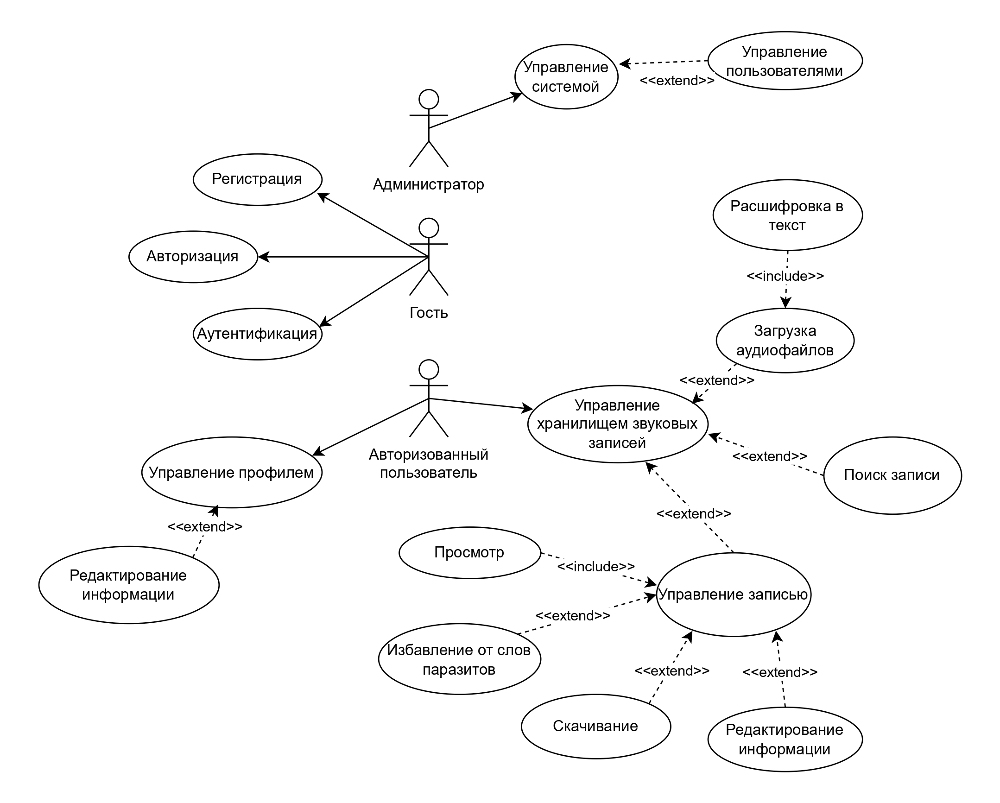

# Веб-приложение для многоголосой расшифровки

Разрабатываемое программное средство представляет собой веб-приложение, предлагающее возможность расшифровывать (
переводить в текстовый формат) аудиофайлы. Оно должно поддерживать регистрацию, авторизацию, аутентификацию; систему
ролей и управление пользователями; расшифровку аудиофайлов по голосам, управление данными и поиск среди них.

Выполнила Козлова Татьяна Владимировна, гр. 353504

### Функциональная модель ПО

Функциональная модель программного средства представлена в виде диаграммы вариантов использования.

Программное средство поддерживает систему ролей: гость, авторизованный пользователь, администратор, им соответственно
выдаются различные права для использования системы. Обычным пользователям доступны роли «Гость» (пользователь, не
зарегистрированный в системе) и «Авторизованный пользователь». Функционал, представленный для каждой роли, обозначен
ниже.

Для роли «Гость» доступен следующий функционал: регистрация, аутентификация, авторизация. После регистрации пользователь
получает роль «Авторизованный пользователь». Для него доступна функция управления хранилищем звуковых записей, функция
управления профилем (включает в себя изменение пароля).

Функция управления хранилищем записей:

- Загрузка аудиофайла весом до 10мб в формате mp3 Файл автоматически расшифровывается в текст. При загрузке
  можно дополнительно указать язык и краткие сведения о теме (разговора) в файле.
- Переход к управлению выбранной звуковой записи (функция управления записью).
- Поиск записи. Доступен поиск по названию и тегам.

Функция управления записью включает в себя:

- избавление от слов-паразитов (доступно для файлов с речью на русском языке);
- скачивание текста-расшифровки в формате docx;
- именование;
- выделение тегов.

Для администратора доступна функция управления пользователями. Это значит, что администратор может удалять, блокировать
и восстанавливать пользователей. Также он обладает доступом к определенным данным в БД.

#### Разработка модели базы данных

За основу модели можно взять предметную область проекта, то есть пользователь, хранилище, звуковая запись:

Пользователь:

- хэшированный пароль;
- id;
- дата регистрации;
- дата последнего изменения;
- роль;
- почта.

Хранилище:

- id;
- id пользователя;
- список звуковых записей.

Звуковая запись:

- id;
- id хранилища;
- имя аудиофайла;
- текст;
- дата последнего изменения;
- список тегов;
- наименование.

### Функциональные требования

Функция регистрации:

- Пользователь инициирует процесс регистрации.
- Для завершения процесса необходимо ввести логин и пароль.
- Система автоматически проверяет надежность пароля с использованием встроенных инструментов безопасности.
- При некорректных данных пользователь получает сообщение об ошибке. Предоставляется возможность исправить данные и
  повторить попытку.
- После успешной регистрации пользователь может изменить пароль.

Функция аутентификации:

- Пользователь инициирует процесс аутентификации.
- Для завершения необходимо ввести корректные логин и пароль.
- Должна быть реализована возможность восстановления пароля: на адрес электронной почты присылается новый пароль; после
  входа по данному паролю пользователь может вновь сменить его на желаемый.
- Пользователь может запросить сброс пароля. На привязанный email отправляется новый пароль. После входа возможна
  установка нового пароля.

Функция расшифровки:

- Расшифровка аудиофайла происходит вместе с его загрузкой в хранилище, инициируемой пользователем.
- От пользователя требуется загрузка файла желательно без шумов, иначе могут происходить ошибки.
- Вместе с загрузкой возможно указание языка для расшифровки и ключевых тем.
- Расшифровка проходит с использованием моделей машинного обучения (whisper и его различных версий) с разделением на
  разных спикеров (поддержка множества голосов).
- Не гарантируется стопроцентная точность передачи информации и речи.
- Возможна медлительность в силу ограничения в ресурсах.
- После расшифровки доступен просмотр полученного текста и его экспорт.

Функция исключения слов-паразитов:

- Пользователь может инициировать исключение слов паразитов (для текста на русском языке).
- Слова-паразиты выбираются из встроенного программой списка.
- Должна быть возможность убирать слова, введенные пользователем, в заданном формате.

Функция поиска звуковых записей:

- Предварительно для каждой личной записи пользователь может обозначить определенные теги в заданном формате.
- В хранилище доступен поиск записей по тегам (одному и больше), указываемым пользователем в определенном формате.
- По завершении поиска выдается список (возможно пустой) соответствующих записей.